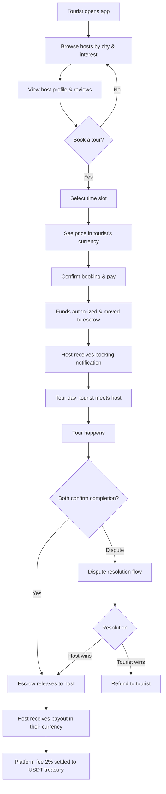
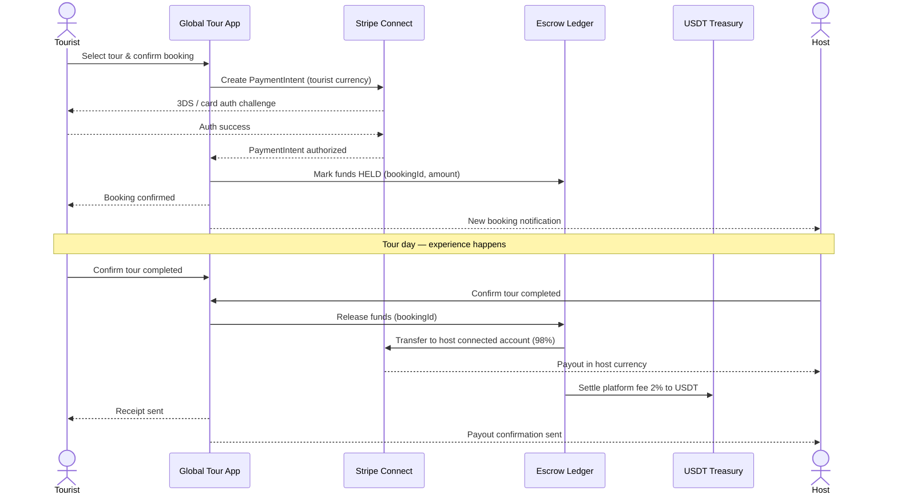
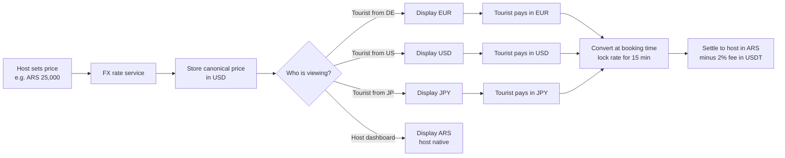
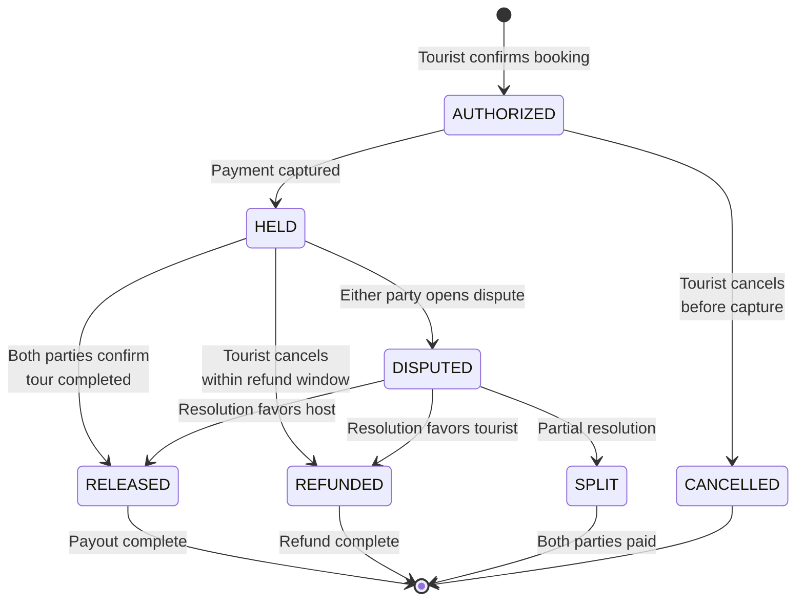

# Global Tour — Flow Diagrams

This document contains the core flows of Global Tour in Mermaid syntax. Render on [mermaid.live](https://mermaid.live), GitHub, or with the VS Code Mermaid extension.

---

## 1. User Journey (Discovery to Payout)

---

## 2. Payment Flow (Sequence Diagram)

---

## 3. Currency Conversion Flow

---

## 4. Escrow State Machine

---

## Notes on rendering

- All diagrams use standard Mermaid 10+ syntax
- State diagram uses `stateDiagram-v2` (required for nested states and notes)
- Sequence diagram uses `actor` keyword for human participants
- For exporting as PNG/SVG: use [mermaid.live](https://mermaid.live) → Actions → Download
